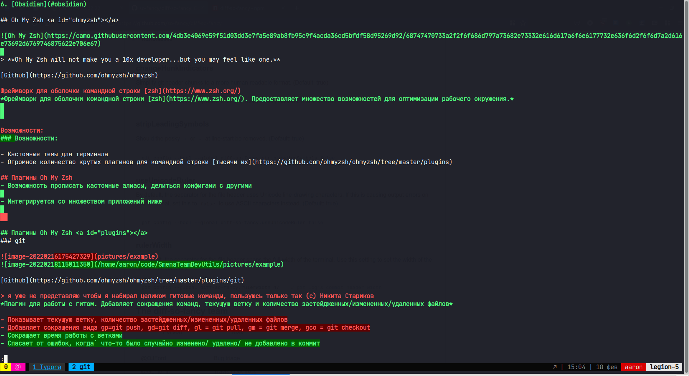
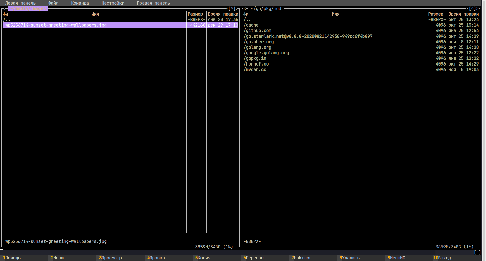
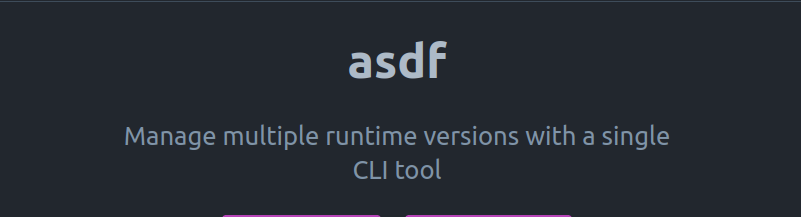
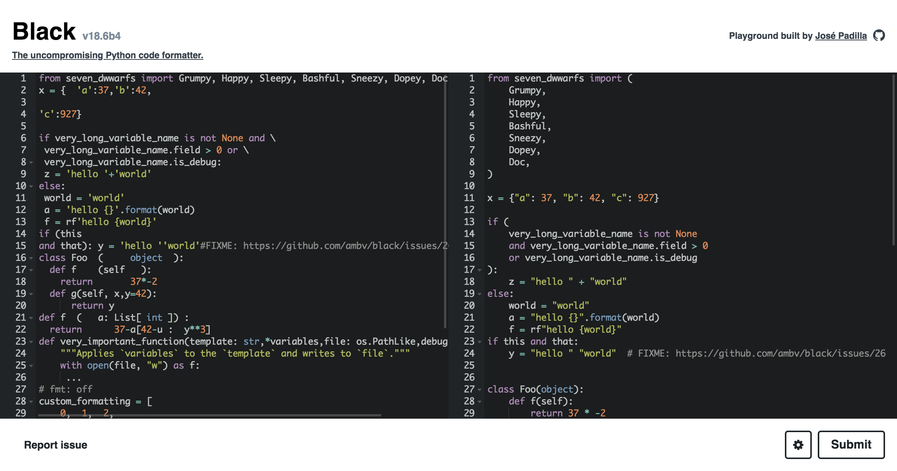

# Инструменты разработчиков

# Содержание

1. [Oh My Zsh](#ohmyzsh)
   1. [Плагины](#plugins)
   2. [Темы](#themes)
2. [RipGrep](#ripgrep)
3. [FZF](#fzf)
4. [Bat](#bat)
5. [LSD](#lsd)
6. [Tmux](#tmux)
6. [Zoxide](#zoxide)
6. [diff-so-fancy](#dsf)
6. [tldr](#tldr)
6. [Midnight commander](#mc)
6. [asdf](#asdf)
6. [lnav](#lnav)
6. [Flameshot](#flameshot)
6. [Guake terminal](#guake)
6. [KeePassXC/Bitwarden](#password)
6. [Obsidian](#obsidian)
6. [Tabnine](#tabnine)
6. [Black](#black)
6. [Poetry](#poetry)
6. [IdeaVim](#ideavim)

## Oh My Zsh <a id="ohmyzsh"></a>


> **Oh My Zsh will not make you a 10x developer...but you may feel like one.**

[Github](https://github.com/ohmyzsh/ohmyzsh)

*Фреймворк для оболочки командной строки [zsh](https://www.zsh.org/). Предоставляет множество возможностей для оптимизации рабочего окружения.*


### Возможности:

- Кастомные темы для терминала
- Огромное количество крутых плагинов для командной строки [тысячи их](https://github.com/ohmyzsh/ohmyzsh/tree/master/plugins)

- Возможность прописать кастомные алиасы, делиться конфигами с другими

- Интегрируется со множеством приложений ниже

  

## Плагины Oh My Zsh <a id="plugins"></a>
### git


[Github](https://github.com/ohmyzsh/ohmyzsh/tree/master/plugins/git)

*Плагин для работы с гитом. Добавляет сокращения команд, текущую ветку и количество застейдженных/измененных/удаленных файлов*

- Сокращает время работы с ветками
- Спасает от ошибок, когда` что-то было случайно изменено/ удалено/ не добавлено в коммит


### zsh-autosuggestions


[Github](https://github.com/zsh-users/zsh-autosuggestions)

*Автоматическое продление команды на основе вашей истории*

- Супер полезная штука для длинных команд плейбуков
- Часто избавляет от необходимости пилить алиасы


### ZSH Auto-Notify


[Github](https://github.com/MichaelAquilina/zsh-auto-notify)

*Присылает уведомление когда долго выполняющаяся команда завершает свою работу.*

- Полезно для операций вроде выгрузки/накатывания миграций/ сборки докер образа, когда хочется переключиться фоном на что-нибудь еще.


### zsh-history-substring-search


[Github](https://github.com/ohmyzsh/ohmyzsh/tree/master/plugins/history-substring-search)

*Поиск по истории через вхождение подстроки*

- Введите фрагмент нужной команды и перемещайтесь по истории через нажатие стрелок вверх-вниз
- Какой там командой обновить конфига nginx?


### zsh-syntax-highlighting


[Github](https://github.com/zsh-users/zsh-syntax-highlighting)

*Подсветка синтаксиса в терминале*

- Поможет отловить синтаксическую ошибку в команде еще на этапе ввода


### history


[Github](https://github.com/ohmyzsh/ohmyzsh/tree/master/plugins/history)

*Объемный поиск по истории для более сложных случаев*

- `h` вывод всей истории, сокращение для `history`
- `hs` сокращение для `history | grep`


## Темы Oh My Zsh<a id="themes"></a>

### Powerlevel10k


[Github](https://github.com/romkatv/powerlevel10k)

Красивая кастомизируемая тема, предоставляющая кучу полезной информации в командной строке

- Отображает текущее виртуальное окружение (у тем zsh с этим проблемы обычно да)
- Хорошо кастомизируется
- Интерактивная настройка с примерами, как будут выглядеть элементы


# RipGrep<a id="ripgrep"></a>


​																								*Сравнение вывода `grep` и `rg`*

[Github](https://github.com/BurntSushi/ripgrep)

*Замена поиску через grep*.

- Поиск выполняется быстрее. В репозитории проекта есть бенчмарки
- Подсветка синтаксиса при выводе
- `rg` на две буквы короче чем `grep`


# FZF<a id="fzf"></a>

# 

[Github](https://github.com/junegunn/fzf)

*Инструмент для нечеткого поиска по файлам. Интегрируется с bat (об этом ниже) для подсветки синтаксиса*

- Поможет, когда не совсем понятно что искать
- Очень быстрый
- Интегрируется с вимом


​																							*Запуск из вима через хоткей*


# Bat<a id="bat"></a>


[Github](https://github.com/sharkdp/bat)

*Замена `cat` с подсветкой синтаксиса,  куча интеграций с другими утилитами:*

- Отображает изменения в файлах через интеграцию с `git`
- Вывод содержимого файла и подсветка синтаксиса в `fzf`
- Подсветка синтаксиса в `RipGrep`
- Превью файлов в `find` или `fd`
- Раскрашивает странички с руководством в `man`


# LSD<a id="lsd"></a>


[Github](https://github.com/Peltoche/lsd)

*Замена `ls` с новыми фичами*

- Цвета для разных типов файлов
- Иконки
- Отображение дерева папок
- Кастомизация форматирования


# Tmux<a id="tmux"></a>


[Github](https://github.com/tmux/tmux)

*Терминальный мультиплексер. Позволяет создавать в терминале сессию с разделением окна и открытием вкладок*

- Запустите сессию на сервере, в сессии - долгий процесс. Подключитесь на следующий день посмотреть результат
- Подключитесь к сессии коллеги посмотреть, что он на проде мутит
- Разделите окно на несколько частей для работы в разных приложениях
- А также кастомизация через плагины и конфиги


# Zoxide<a id="zoxide"></a>


~~~sh
```sh
z foo              # cd into highest ranked directory matching foo
z foo bar          # cd into highest ranked directory matching foo and bar
z foo /            # cd into a subdirectory starting with foo

z ~/foo            # z also works like a regular cd command
z foo/             # cd into relative path
z ..               # cd one level up
z -                # cd into previous directory

zi foo             # cd with interactive selection (using fzf)

z foo<SPACE><TAB>  # show interactive completions (zoxide v0.8.0+, bash/fish/zsh only)
```
~~~

[Github](https://github.com/ajeetdsouza/zoxide)

*Умная вариация `cd` запоминает самые посещаемые директории, позволяя переместиться в них короткой командой*

- Переместиться в директорию проекта farfor можно командой `z farfor` или даже `z f` где бы она ни была на диске


# Diff-so-fancy<a id="dsf"></a>




[Github](https://github.com/so-fancy/diff-so-fancy)

*Форматирование `diff` в человеко-читаемый вид*

- Более понятный вывод git diff
- За счет этого меньше вероятность допустить ошибку


# tldr<a id="tldr"></a>


[Github](https://github.com/tldr-pages/tldr)

*Коллекция небольших инструкций для консольных приложений, поддерживаемая сообществом.* 

- Не нужно запоминать пять флагов для распаковки архива через tar
- Как там посмотреть историю коммитов в git?
- Скорее всего, это то что вы хотели узнать


# Midnight commander<a id="mc"></a>



[Github](https://github.com/MidnightCommander/mc)

*Терминальный файловый менеджер с поддержкой ssh соединения*

- Подключитесь к удаленной машине, копируйте и удаляйте файлы с удобным интерфейсом
- Больше никакого экранирования пробелов при копировании через scp


# asdf<a id="asdf"></a>



[Github](https://github.com/asdf-vm/asdf)

*Инструмент для управления версиями языков, установленных в системе. Это как gvm, nvm, rbenv и pyenv всё в одном.*

- Один инструмент для всех языков
- Автоматически переключает версию установленного языка в зависимости от локальных настроек директории
- Автокомплит для bash и zsh
- Установите нужную версию питона/ноды/го двумя командами


# lnav<a id="lnav"></a>


[Github](https://github.com/tstack/lnav)

*Инструмент для просмотра логов*

- Автоматически определяет формат логов, форматирует их
- Фильтрация логов по регулярке
- SQL синтаксис для поиска по логам
- Темы, подсветка синтаксиса и много другого


Flameshot<a id="flameshot"></a>
=======


[Github](https://github.com/flameshot-org/flameshot)

*Бесплатный кроссплатформенный инструмент с открытым исходным кодом для создания скриншотов со множеством встроенных функций, позволяющих сэкономить время.* 

- После скриншота не нужно отдельно их редактировать, доступно в приложении.
- Удобный интерфейс со множеством настроек "под себя".
- Простое и интуитивно понятное использование.


## Guake Terminal<a id="guake"></a>


[Github](https://github.com/Guake/guake) 

*Представляет собой Quake-подобный (как выпадающий терминал в игре Quake) эмулятор терминала.*
*Основная функция этого инструмента — вызывать терминал при нажатии на горячую клавишу.*

- Скорость и удобство при открытии терминала.
- Поддерживает несколько мониторов, терминал открывается на активном.
- Настройка тем, размеров и прозрачности.


## KeePassXC/Bitwarden<a id="password"></a>


[Github-KeePassXC](https://github.com/keepassxreboot/keepassxc) [Github-Bitwarden](https://github.com/bitwarden) 

*Бесплатные менеджеры паролей с открытым исходным кодом.*

Используют:

- Полное шифрование базы данных с использованием 256-битного AES.
- Имеют нескольких форматов, включая веб-интерфейс, настольные приложения, расширение браузера.
- Кроссплатформенность.


## Obsidian<a id="obsidian"></a>


[Obsidian](https://obsidian.md/) 

*Приложение для ведения базы знаний, имеет большое количество плагинов для тонкой настройки.*
*Главной функцией является построение графов, основанных на связях ваших заметок.*

- Возможность синхронизации через Git.
- Использует Markdown формат файлов.
- Есть мобильное приложение с полным функционалом десктопного.
- Из минусов, не является Open-Sourсe приложением


# Плагины для IDE


## TabNine<a id="tabnine"></a>


[TabNine](https://www.tabnine.com/) 

*TabNine представляет собой самообучаемую нейросеть, которая анализирует набираемый код и выдает оптимальные возможные варианты дальнейшего развития событий через autocomplete.*

- Поддерживает 22 языка, включая Python, JavaScript, Java, C ++, C, PHP, Go, C #, Ruby, Objective-C, Rust и Swift.
- Доступен для VS Code, Sublime Text, Atom, Emacs и Vim.


## black<a id="black"></a>



[black](https://black.readthedocs.io/en/stable/integrations/editors.html) 

*Black — это средство форматирования, совместимое с PEP8, но со своим собственным стилем.* 

- Прост и эффективен в использовании.


## poetry<a id="poetry"></a>


[poetry](https://www.tabnine.com/) 

*Poetry позволяет рулить сразу кучей вещей — версией языка в вашем проекте, зависимостями, подключаемыми путями, скриптами тестирования/разработки, сборкой и публикацией билдов. Все необходимые пути, зависимости и скрипты описываются в специальном файле pyproject*

- Создает и упаковывает проекты с помощью одной команды.
- Публикует проекты в PyPI и приватных репозиториях.
- Проверяет состояния зависимостей одной командой.
- Фиксирует версии зависимостей.
- Управляет публикацией билдов.
- Использует ваши настроенные виртуальные сервера или создает собственное виртуальное окружение для полной изоляции от вашей системы.


## IdeaVim<a id="ideavim"></a>


[IdeaVim](https://plugins.jetbrains.com/plugin/164-ideavim) 

*IdeaVim поддерживает множество функций Vim.*

- Обычный/вставка/визуальный режим, клавиши движения, удаление/изменение.
- Метки, регистры, некоторые команды Ex, регулярные выражения Vim.
- Настройка через ~/.ideavimrc, макросы, плагины Vim и т. д. 
