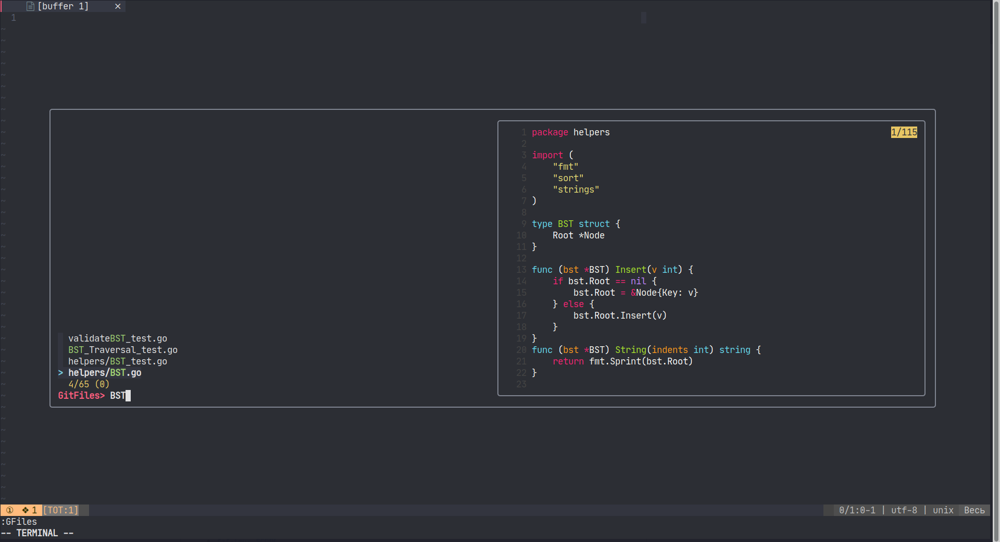
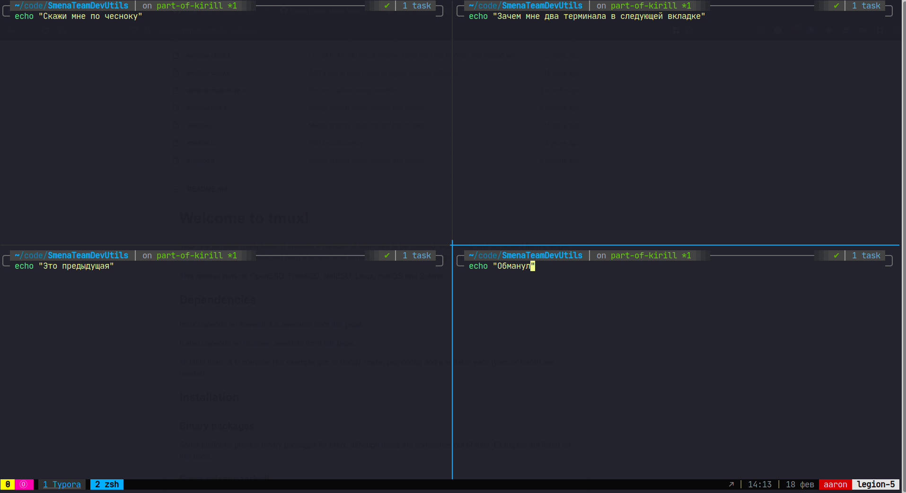

# Инструменты разработчиков

# Содержание

1. [Oh My Zsh](#ohmyzsh)
   1. [Плагины](#plugins)
   2. [Темы](#themes)

2. [RipGrep](#ripgrep)
3. [FZF](#fzf)
4. [Bat](#bat)
5. [LSD](#lsd)
6. [Tmux](#tmux)

## Oh My Zsh 

> **Oh My Zsh will not make you a 10x developer...but you may feel like one.**

[Github](https://github.com/ohmyzsh/ohmyzsh)

*Фреймворк для оболочки командной строки [zsh](https://www.zsh.org/). Предоставляет множество возможностей для оптимизации рабочего окружения.*

### Возможности:

- Кастомные темы для терминала
- Огромное количество крутых плагинов для командной строки [тысячи их](https://github.com/ohmyzsh/ohmyzsh/tree/master/plugins)

- Возможность прописать кастомные алиасы, делиться конфигами с другими

- Интегрируется со множеством приложений ниже

  

## Плагины Oh My Zsh 

### git

[Github](https://github.com/ohmyzsh/ohmyzsh/tree/master/plugins/git)

*Плагин для работы с гитом. Добавляет сокращения команд, текущую ветку и количество застейдженных/измененных/удаленных файлов*

- Сокращает время работы с ветками
- Спасает от ошибок, когда` что-то было случайно изменено/ удалено/ не добавлено в коммит

### zsh-autosuggestions 

[Github](https://github.com/zsh-users/zsh-autosuggestions)

*Автоматическое продление команды на основе вашей истории*

- Супер полезная штука для длинных команд плейбуков
- Часто избавляет от необходимости пилить алиасы

### ZSH Auto-Notify

[Github](https://github.com/MichaelAquilina/zsh-auto-notify)

*Присылает уведомление когда долго выполняющаяся команда завершает свою работу.*

- Полезно для операций вроде выгрузки/накатывания миграций/ сборки докер образа, когда хочется переключиться фоном на что-нибудь еще.

### zsh-history-substring-search

[Github](https://github.com/ohmyzsh/ohmyzsh/tree/master/plugins/history-substring-search)

*Поиск по истории через вхождение подстроки*

- Введите фрагмент нужной команды и перемещайтесь по истории через нажатие стрелок вверх-вниз
- Какой там командой обновить конфига nginx?

### zsh-syntax-highlighting

[Github](https://github.com/zsh-users/zsh-syntax-highlighting)

*Подсветка синтаксиса в терминале*

- Поможет отловить синтаксическую ошибку в команде еще на этапе ввода

### history

[Github](https://github.com/ohmyzsh/ohmyzsh/tree/master/plugins/history)

*Объемный поиск по истории для более сложных случаев*

- `h` вывод всей истории, сокращение для `history`
- `hs` сокращение для `history | grep`

## Темы Oh My Zsh

### Powerlevel10k

[Github](https://github.com/romkatv/powerlevel10k)

Красивая кастомизируемая тема, предоставляющая кучу полезной информации в командной строке

- Отображает текущее виртуальное окружение (у тем zsh с этим проблемы обычно да)
- Хорошо кастомизируется
- Интерактивная настройка с примерами, как будут выглядеть элементы

# RipGrep

​																								*Сравнение вывода `grep` и `rg`*

[Github](https://github.com/BurntSushi/ripgrep)

*Замена поиску через grep*.

- Поиск выполняется быстрее. В репозитории проекта есть бенчмарки
- Подсветка синтаксиса при выводе
- `rg` на две буквы короче чем `grep`

# FZF

[Github](https://github.com/junegunn/fzf)

*Инструмент для нечеткого поиска по файлам. Интегрируется с bat (об этом ниже) для подсветки синтаксиса*

- Поможет, когда не совсем понятно что искать
- Очень быстрый
- Интегрируется с вимом

​																							*Запуск из вима через хоткей*

# Bat

[Github](https://github.com/sharkdp/bat)

*Замена `cat` с подсветкой синтаксиса,  куча интеграций с другими утилитами:*

- Отображает изменения в файлах через интеграцию с `git`
- Вывод содержимого файла и подсветка синтаксиса в `fzf`
- Подсветка синтаксиса в `RipGrep`
- Превью файлов в `find` или `fd`
- Раскрашивает странички с руководством в `man`

# LSD

[Github](https://github.com/Peltoche/lsd)

Замена `ls` с новыми фичами

- Цвета для разных типов файлов
- Иконки
- Отображение дерева папок
- Кастомизация форматирования

# Tmux

[Github](https://github.com/tmux/tmux)

Терминальный мультиплексер. Позволяет создавать в терминале сессию с разделением окна и открытием вкладок

- Запустите сессию на сервере, в сессии - долгий процесс. Подключитесь на следующий день посмотреть результат
- Подключитесь к сессии коллеги посмотреть, что он на проде мутит
- Разделите окно на несколько частей для работы в разных приложениях
- А также плагины и кастомизация через конфиги