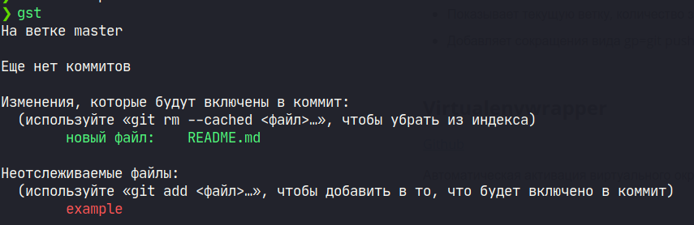
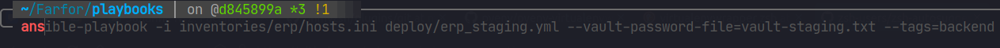
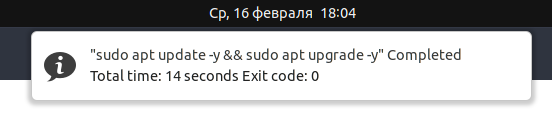
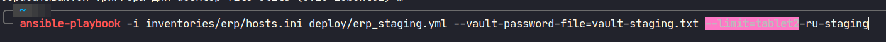
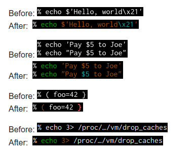
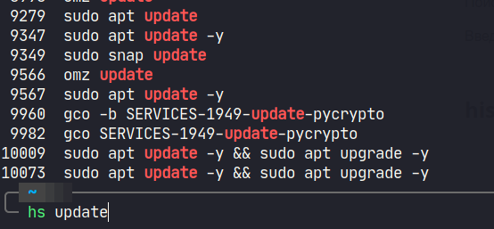
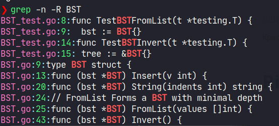
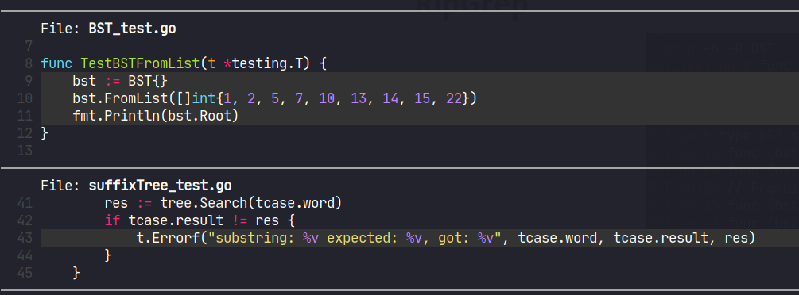
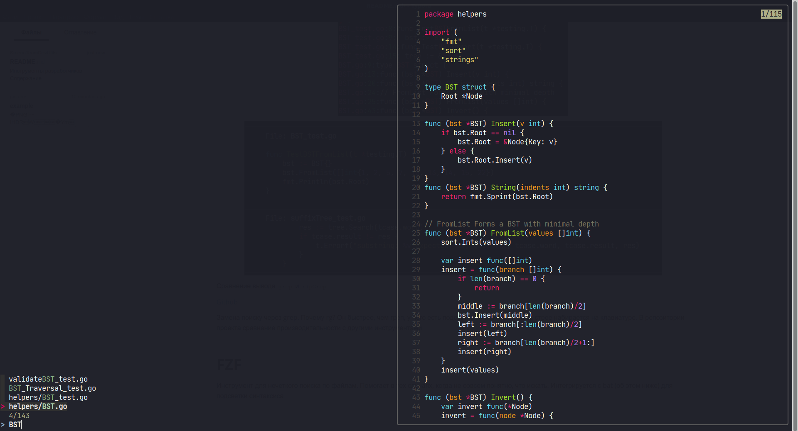

# Инструменты разработчиков

# Содержание

1. [Oh My Zsh](#ohmyzsh)

## Oh My Zsh 

> **Oh My Zsh will not make you a 10x developer...but you may feel like one.**

[Github](https://github.com/ohmyzsh/ohmyzsh)

Фреймворк для оболочки командной строки [zsh](https://www.zsh.org/)

Возможности:

- Кастомные темы для терминала
- Огромное количество крутых плагинов для командной строки [тысячи их](https://github.com/ohmyzsh/ohmyzsh/tree/master/plugins)

## Плагины Oh My Zsh

### git

[Github](https://github.com/ohmyzsh/ohmyzsh/tree/master/plugins/git)

> я уже не представляю чтобы я набирал целиком гитовые команды, пользуюсь только так (c) Никита Стариков

- Показывает текущую ветку, количество застейдженных/измененных/удаленных файлов
- Добавляет сокращения вида gp=git push, gd=git diff, gl = git pull, gm = git merge, gco = git checkout

### zsh-autosuggestions

[Github](https://github.com/zsh-users/zsh-autosuggestions)

Автоматическое продление команды на основе вашей истории

### ZSH Auto-Notify

[Github](https://github.com/MichaelAquilina/zsh-auto-notify)

Присылает уведомление когда долго выполняющаяся команда завершает свою работу. Полезно для операций вроде выгрузки/накатывания миграций/ сборки докер образа, когда хочется переключиться фоном на что-нибудь еще.

### zsh-history-substring-search

[Github](https://github.com/ohmyzsh/ohmyzsh/tree/master/plugins/history-substring-search)

Поиск по истории через вхождение подстроки

Введите фрагмент нужной команды и перемещайтесь по истории через нажатие стрелок вверх-вниз

### zsh-syntax-highlighting

[Github](https://github.com/zsh-users/zsh-syntax-highlighting)

Подсветка синтаксиса в терминале

### history

[Github](https://github.com/ohmyzsh/ohmyzsh/tree/master/plugins/history)

Объемный поиск по истории для более сложных случаев

## Темы Oh My Zsh

### Powerlevel10k

[Github](https://github.com/romkatv/powerlevel10k)

Красивая кастомизируемая тема, предоставляющая кучу полезной информации в командной строке

# RipGrep

Сравнение вывода `grep` и `ripGrep`

[Github](https://github.com/BurntSushi/ripgrep)

Замена поиску через grep. Почему rg? Он быстрее, чем греп, у него есть подсветка синтаксиса и он быстрее набирается на клавиатуре. В репозитории проекта сравнение производительности с другими инструментами

# FZF

[Github](https://github.com/junegunn/fzf)

Инструмент для нечеткого поиска по файлам. Помогает в тех случаях, когда не совсем понятно, что искать. Интегрируется с bat (об этом ниже) для подсветки синтаксиса

# Bat

[Github](https://github.com/sharkdp/bat)

Как cat, только bat. Вывод содержимого файла в консоль с подсветкой синтаксиса. Под куча интеграций с другими утилитами:

- Отображает изменения в файлах через интеграцию с `git`
- Вывод содержимого файла и подсветка синтаксиса в `fzf`
- Подсветка синтаксиса в `RipGrep`
- Превью файлов в `find` или `fd`
- Раскрашивает странички с руководством в `man`

## Flameshot

[Github](https://github.com/flameshot-org/flameshot)

Бесплатный кроссплатформенный инструмент с открытым исходным кодом для создания скриншотов со множеством встроенных функций, позволяющих сэкономить время. 

- После скриншота не нужно отдельно их редактировать, доступно в приложении.
- Удобный интерфейс со множеством настроек "под себя".
- Простое и интуитивно понятное использование.

## Guake Terminal

[Github](https://github.com/Guake/guake) 

Представляет собой Quake-подобный (как выпадающий терминал в игре Quake) эмулятор терминала.
Основная функция этого инструмента — вызывать терминал при нажатии на горячую клавишу.

- Скорость и удобство при открытии терминала.
- Поддерживает несколько мониторов, терминал открывается на активном.
- Настройка тем, размеров и прозрачности.

## KeePassXC/Bitwarden

[Github-KeePassXC](https://github.com/keepassxreboot/keepassxc) [Github-Bitwarden](https://github.com/bitwarden) 

Бесплатные менеджеры паролей с открытым исходным кодом.

Используют:

- Полное шифрование базы данных с использованием 256-битного AES.
- Имеют нескольких форматов, включая веб-интерфейс, настольные приложения, расширение браузера.
- Кроссплатформенность.

## Obsidian

[Obsidian](https://obsidian.md/) 

Приложение для ведения базы знаний, имеет большое количество плагинов для тонкой настройки.
Главной функцией является построение графов, основанных на связях ваших заметок.

- Возможность синхронизации через Git.
- Использует Markdown формат файлов.
- Есть мобильное приложение с полным функционалом десктопного.
- Из минусов, не является Open-Sourсe приложением
